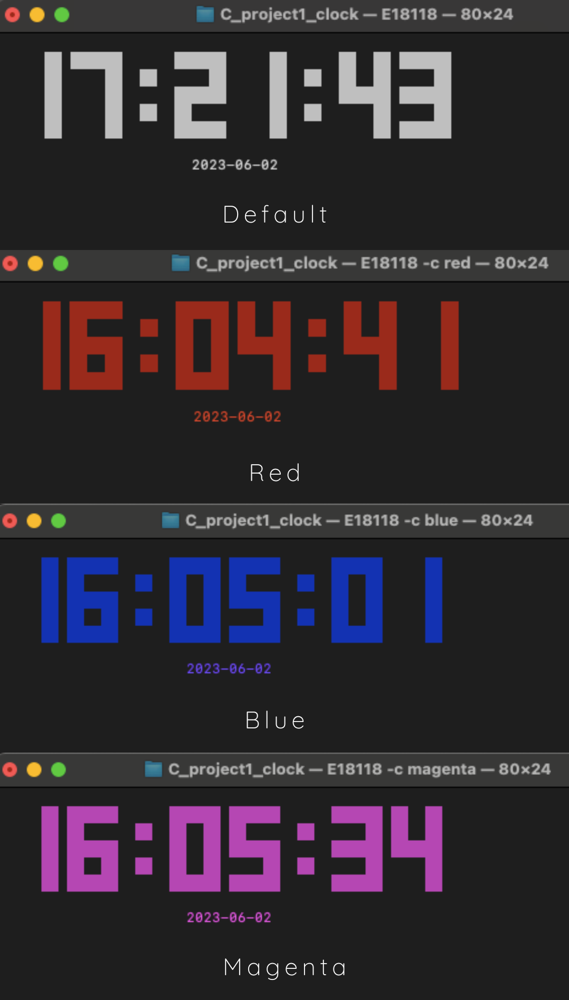

# Digital-clock-cli

## Description
Developed a program that displays the current time and the date on a linux terminal. When a colour is given to the program as an argument, it should be able to display the clock with that colour.

## Outcome
I have gained proficiency in working within a Linux environment, demonstrating competence in utilizing ANSI characters to construct basic figures and characters, efficiently handling command line arguments, and effectively employing debugging techniques.  

## Usage 
* Assuming program name is clock
1. ./clock -h 
     + Quick help given on terminal
2. ./clock 
    + Prints the clock in default color(white)
3. ./clock -c \<color>  
    + Prints a clock with a color.The Following colors are supported,
        * red
        * green
        * yellow
        * blue
        * magenta
        * cyan

## Output

